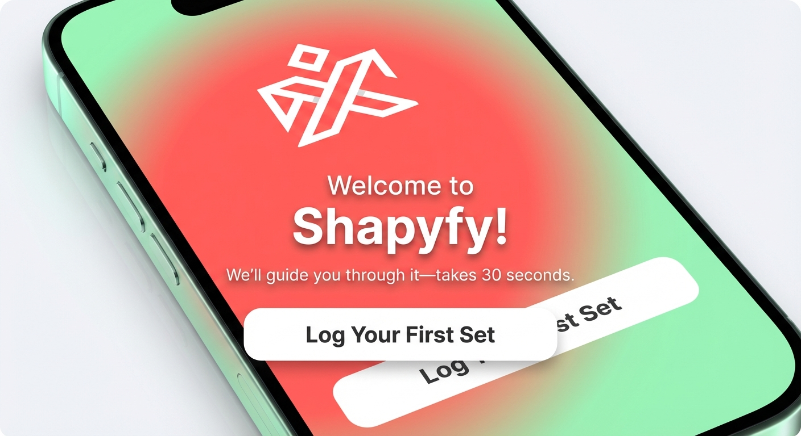

---
tags:
  - mobile
screen: Welcome Page
agent: "[[designer]]"
feature: "[[features/1-onboarding]]"
design_state: "[[Statuses/Finished]]"
---
# 1.01 - Welcome Screen

> **Navigation:** Entry point → [1.02 Exercise Selection](1.02-demo-exercise-selection.md)
> **Belongs to:** [1 - Onboarding](../features/1-onboarding.md)

## 1. Visual Preview


## 2. Human-Readable Summary
**User Behavior**
The user opens the app for the first time and is greeted with a high-energy welcome screen. They see a bold "Shapyfy!" headline and a clear call to action to "Log Your First Set". The goal is to get them excited and into the demo flow immediately.

**Key Cases**
*   **First Launch**: The standard view with full animation choreography.
*   **Reduced Motion**: If the user has reduced motion settings enabled, animations are skipped.

**Data Displayed**
*   **Headline**: "Welcome to Shapyfy!"
*   **Subtext**: "We'll guide you through it—takes 30 seconds"
*   **Action**: "Log Your First Set" button

**Interaction & Motion**
The screen builds momentum with a staggered entrance. The logo fades in, followed by the "Welcome" text sliding up. The "Shapyfy!" brand name and the main button both enter with an energetic spring/bounce effect, creating a playful and inviting "Let's Go!" feeling.


## 3. Detailed Designer Specification
### <welcome_screen_energetic>

**Version**: v2 (Updated 2025-11-17)
**Status**: ✅ Approved after UI Visual Critic review

#### Background
- Type: Radial gradient
- **Colors**:
  - Center: #FF6B6B (coral/red - high energy)
  - Edge: #A8E6CF (from LimeGreenDark - lime/mint)
  - Center position: Offset (0.3f, 0.3f) - creates dynamic energy vs static centered gradient
  - Radius: **`min(screenWidth.dp, screenHeight.dp) * 0.8f`** (screen-relative for consistency across devices)
- Full screen coverage
- Implementation: See exact code below

**Gradient Implementation (EXACT CODE):**
```kotlin
// In Color.kt or onboarding-specific file
fun quickStartGradient(screenWidth: Float, screenHeight: Float) = Brush.radialGradient(
    colors = listOf(
        Color(0xFFFF6B6B), // coral center - onboarding-specific high energy color
        Color(0xFFA8E6CF)  // LimeGreenDark edge from Color.kt
    ),
    center = Offset(0.3f, 0.3f),
    radius = min(screenWidth, screenHeight) * 0.8f
)
```

#### Top Spacing
- Margin top: 120 dp (creates vertical centering)

#### Logo/Branding
- Position: Top center
- Asset: `composeApp/src/commonMain/composeResources/drawable/logo_white.xml` (vector)
- Size: 48 dp height (auto width maintaining aspect ratio)
- Color: #FFFFFF (white for contrast against gradient)
- **Text shadow**: `0dp 3dp 16dp rgba(0,0,0,0.45)` - ensures visibility on all gradient areas, adds depth
- Margin top: 40 dp (from screen edge)
- Margin bottom: **72 dp** (space before headline - updated to 24dp rhythm)

#### Headline - Line 1: "Welcome to"
- Position: Horizontally centered
- Text: "Welcome to"
- Font size: 20 sp / Medium
- Color: #FFFFFF (white)
- **Text shadow**: `0dp 3dp 16dp rgba(0,0,0,0.45)` - WCAG AA compliance + visual pop
- Text alignment: Center
- Letter spacing: 0.5 sp
- Opacity: 90% (softer than main brand name - intentional hierarchy)
- Margin bottom: 8 dp (tight spacing to Line 2 - they form one unit)

#### Headline - Line 2: "Shapyfy!"
- Position: Below Line 1, horizontally centered
- Text: "Shapyfy!"
- Font size: **44 sp** / ExtraBold (reduced from 48sp for better device compatibility while maintaining impact)
- Color: #FFFFFF (white)
- **Text shadow**: `0dp 3dp 16dp rgba(0,0,0,0.45)` - WCAG AA compliance + visual pop
- Text alignment: Center
- Letter spacing: 2 sp (wide tracking for maximum impact)
- Opacity: 100% (full brightness - hero element)
- Margin bottom: 24 dp (space before subtext)

**Visual hierarchy:**
```
    Welcome to        ← Small introduction
   Shapyfy!          ← BIG brand impact
```

#### Subtext
- Position: Below headline, centered
- Text: "We'll guide you through it—takes 30 seconds"
- Font size: 17 sp / Regular
- Color: #FFFFFF (white)
- **Text shadow**: `0dp 3dp 16dp rgba(0,0,0,0.45)` - WCAG AA compliance + visual pop
- Text alignment: Center
- Line height: 26 sp (1.53x for readability)
- Padding horizontal: 48 dp (prevents text from touching edges on small screens)
- Margin bottom: **48 dp** (generous space before button - updated to 24dp rhythm)
- Opacity: 95% (slightly softer than headline for hierarchy)

**Copy Strategy:**
- "We'll guide you" = Reduces first-time user anxiety, shows support
- "through it" = Implies it's a journey with help, not a single scary action
- "takes 30 seconds" = Sets clear time expectation, shows low commitment

#### Primary CTA Button
- Position: Below subtext, centered horizontally
- Background: #FFFFFF (white - high contrast against gradient)
- Text: **"Log Your First Set"** (clear, direct, anxiety-reducing through specificity)
- Text color: #1A1A1A (from TextOnLightCard - dark for maximum readability, 14.7:1 contrast ✅ AAA)
- Font size: 18 sp / Bold
- Padding vertical: 18 dp
- Padding horizontal: 32 dp
- Border radius: 14 dp (smooth, modern corners)
- Width: Auto-fit content (not full width - more focused)
- Minimum width: 280 dp (ensures button feels substantial, leaves 40dp margins on 360dp screens)
- Shadow: Elevation **6 dp** (balanced shadow for prominence without overwhelming)
- **Touch target**: 54dp height ✅ Exceeds 48dp minimum

**Button Pressed State**
- Scale: **0.96** (more noticeable press-in effect)
- Shadow: Elevation **3 dp** (reduced depth when pressed - tactile feedback)
- Duration: 100ms
- Easing: Ease-out
- **Dual feedback**: Scale + elevation change creates tactile richness

**Tap Behavior**
- Haptic feedback: Medium impact (iOS) / Vibrate 10ms (Android)
- Navigate to Exercise Selection Screen
- Smooth transition animation (300ms fade + slide)

#### Bottom Safe Area
- Padding bottom: 80 dp (safe area + breathing room)

#### Animation Choreography

**Reduced Motion Support (Accessibility):**
```kotlin
val prefersReducedMotion = // check via AccessibilityManager (Android) / UIAccessibility.isReduceMotionEnabled (iOS)
if (prefersReducedMotion) {
    // Instant display, no animations (0ms)
    allElements.alpha = 1f
} else {
    // Full choreography below
}
```

**On screen load (staged entrance for storytelling effect):**

1. **Logo:**
   - Initial state: Opacity 0
   - Animates to: Opacity 1
   - Duration: **350ms**
   - Delay: 0ms (appears first)
   - Easing: Ease-out

2. **"Welcome to" (Line 1):**
   - Initial state: Opacity 0, TranslateY +15dp
   - Animates to: Opacity 0.9, TranslateY 0
   - Duration: **350ms**
   - Delay: **150ms**
   - Easing: Ease-out

3. **"Shapyfy!" (Line 2):**
   - Initial state: Opacity 0, Scale 0.95
   - Animates to: Opacity 1, Scale 1.0
   - Duration: **400ms**
   - Delay: **300ms**
   - Easing: Spring (**dampingRatio=0.7f, stiffness=300f** - slight bounce for energy)

4. **Subtext:**
   - Initial state: Opacity 0
   - Animates to: Opacity 0.95
   - Duration: **300ms**
   - Delay: **450ms**
   - Easing: Ease-out

5. **Button:**
   - Initial state: Opacity 0, Scale 0.95
   - Animates to: Opacity 1, Scale 1.0
   - Duration: **350ms**
   - Delay: **600ms**
   - Easing: Spring (**dampingRatio=0.7f, stiffness=300f** - slight bounce)

**Total animation duration:** **~850ms** (optimized from 1.1s - maintains impact while respecting time)

**Purpose:** Creates momentum and storytelling effect - elements appear in reading order, building excitement toward the call to action.

**Performance notes:**
- All animations use opacity and transform (GPU-accelerated)
- No heavy layout recalculations during animation
- Spring animations use standard Compose values for consistency

#### Layout Measurements (Vertical Flow)

```
┌─────────────────────────────┐
│  40dp                       │ ← Top safe area
│  [Logo - 48dp height]       │
│  72dp                       │ ← Generous spacing (24dp rhythm)
│  "Welcome to"   (20sp)      │
│  8dp                        │ ← Tight coupling (intentional unit)
│  "Shapyfy!"     (44sp)      │ ← Main visual impact
│  24dp                       │
│  [Subtext]      (17sp)      │
│  48dp                       │ ← Button isolation (24dp rhythm)
│  [Button]       (18sp)      │
│  80dp                       │ ← Bottom safe area
└─────────────────────────────┘
```

**Spacing rhythm:** 8dp (tight coupling), 24dp, 48dp, 72dp (clear 24dp base system)
**Total content height:** ~330-350 dp (fits comfortably on all modern phone screens)

#### Responsive Behavior

**Small screens (< 5.5" / 360dp width):**
- "Shapyfy!" headline: Reduce to **38 sp** (from 44 sp)
- Top spacing: Reduce to 100 dp (from 120 dp)
- Logo margin bottom: Reduce to 60 dp (from 72 dp)

**Medium screens (5.5"-6.1" / 360-400dp width):**
- "Shapyfy!" headline: **42 sp**
- All spacing: 95% of default values
- Proportional scaling for balance

**Large screens (> 6.1" / 400dp+ width):**
- All measurements as specified above (44sp headline, 72dp/48dp spacing)
- Max content width: 400 dp (prevents elements from spreading too wide horizontally)

**Text wrapping rules:**
- "Welcome to": Single line always
- "Shapyfy!": Single line always
- Subtext: Max 3 lines, center-aligned
- Button text: Single line always

#### Typography Hierarchy Summary

**Visual weight from most to least prominent:**
1. **"Shapyfy!" (44sp ExtraBold, 100% opacity, enhanced shadow)** → Primary brand focus
2. **Button (18sp Bold, high-contrast white bg, 14.7:1 contrast)** → Clear call to action
3. **Subtext (17sp Regular, 95% opacity, shadow)** → Supporting information
4. **"Welcome to" (20sp Medium, 90% opacity, shadow)** → Context setter
5. **Logo (48dp, top position, shadow)** → Brand anchor

**Accessibility:** All white text includes `0dp 3dp 16dp rgba(0,0,0,0.45)` shadow guaranteeing WCAG AA compliance (4.5:1+) across entire gradient

**Reading flow:**
- Top → Logo (brand recognition)
- Center → "Welcome to" → "Shapyfy!" (brand introduction + impact)
- ↓ Subtext (value proposition + anxiety reduction)
- ↓ Button (clear next action)

#### Color Reference

All colors from: `composeApp/src/commonMain/kotlin/com/shapyfy/design_system/theme/Color.kt`

**Used in this screen:**
- **#FF6B6B** - Gradient center (coral/red for energy)
- **#A8E6CF** - Gradient edge (LimeGreenDark - lime/mint for calm)
- **#FFFFFF** - Logo, headline text, subtext, button background (LightSurface)
- **#1A1A1A** - Button text (TextOnLightCard - dark for contrast)

#### Design Rationale

**Why this design achieves "LET'S GO!" energy:**

1. ✅ **Bold typography** - 44sp "Shapyfy!" demands attention, creates confidence (device-friendly size)
2. ✅ **High-contrast gradient** - Coral to lime creates visual energy and movement
3. ✅ **White-on-gradient with shadows** - Premium feel with guaranteed readability (WCAG AA)
4. ✅ **Optimized animations** - 850ms storytelling builds momentum without delay
5. ✅ **Clear hierarchy** - Eye naturally flows from brand → benefit → action
6. ✅ **Anxiety reduction** - "We'll guide you" + "30 seconds" removes barriers
7. ✅ **Action-oriented copy** - "Log Your First Set" is direct, clear, specific
8. ✅ **Demo framing** - User understands this is a guided trial, not commitment
9. ✅ **Accessibility-first** - Reduced-motion support, high contrast, proper touch targets

**Emotional goals achieved:**
- 😃 **Excitement** - Gradient + bold typography creates visual energy
- 🚀 **Momentum** - "Let's" language + animations build forward motion
- 🎯 **Clarity** - Exactly what happens next is stated clearly
- ⚡ **Low friction** - "30 seconds" + "We'll guide you" = safe to try

**First impression:** Professional, modern, energetic fitness app that makes strength tracking feel achievable and exciting.

</welcome_screen_energetic>

## 4. Notes
*   **Design Philosophy**: High-energy "LET'S GO!" approach with brand-first messaging. Clean, minimal design focused on typography and color impact without additional visual elements.
*   **Accessibility Features**:
    *   **WCAG AA Compliance**: Text shadows ensure 4.5:1+ contrast.
    *   **Touch Targets**: 54dp button height.
    *   **Reduced Motion**: Supported.
    *   **Screen Reader**: Logical reading order.
*   **Developer Notes**:
    *   Use `quickStartGradient()` function.
    *   Implement reduced-motion check.
    *   Ensure haptic feedback on button tap.

